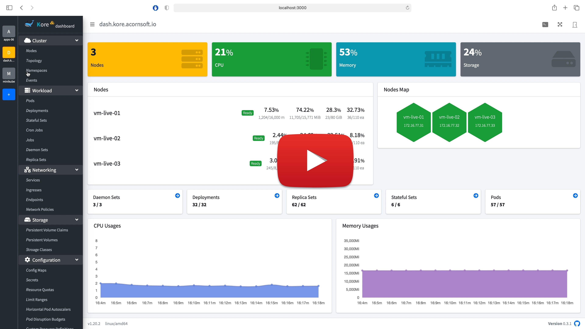

# Kore Board :whale:
> Kubernetes multi-clusters dashboard

       

Kore-board is a web-based UI for Kubernetes multi-clusters management.  It allows users to manage applications running in the multi-clusters as well as the cluster itself.
Kore보드는 쿠버네티스 다중 클러스터 관리를 위한 웹 기반 UI입니다. 사용자는 다중 클러스터에서 실행되고 있는 애플리케이션 뿐만 아니라 클러스터 자체를 관리할 수 있습니다.

[](https://www.youtube.com/watch?v=Z75pBBqL0u8)

## Getting Started

### Installation

```
$ kubectl apply -f https://raw.githubusercontent.com/acornsoftlab/dashboard/master/scripts/install/kuberntes/recommended.yaml
```
See [Installation Guide](./docs/user/installation.md) page for more information

### Access

1. Open in your browser `http://<cluster-ip>:30080/`
2. On the sign-in page, enter "acornsoft" as a token string and sign in


## [Documentation](./docs/README.md)

See [User Guide](./docs/user/README.md) page.
See [Developer Guide](./docs/developer/README.md) page.

## Contribution

See [Contributing](./CONTRIBUTING.md) page.