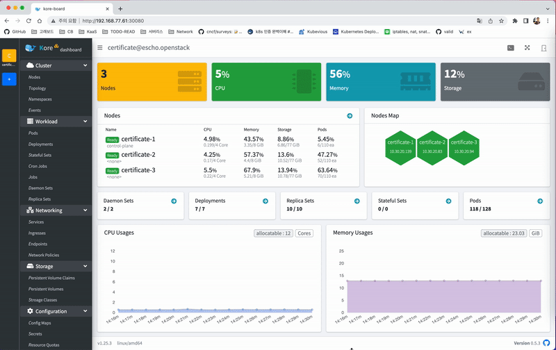
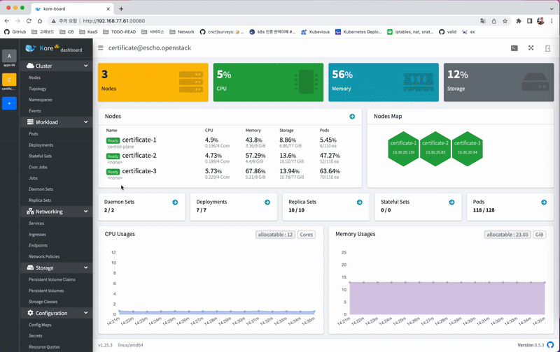
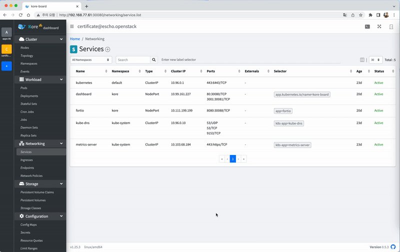
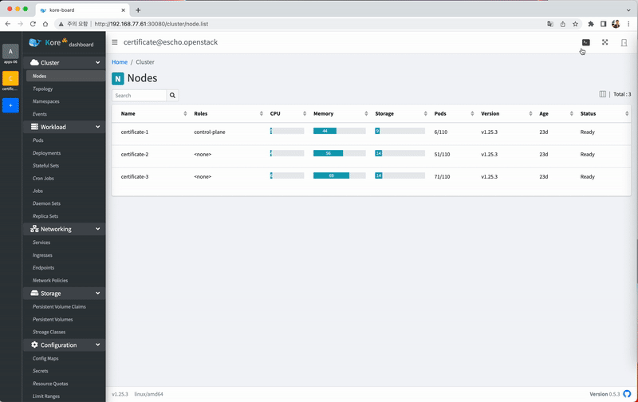

# Kore Board :whale:
> Kubernetes multi-clusters dashboard

       

Kore-board is a web-based UI for Kubernetes multi-clusters management.  It allows users to manage applications running in the multi-clusters as well as the cluster itself.
Kore보드는 쿠버네티스 다중 클러스터 관리를 위한 웹 기반 UI입니다. 사용자는 다중 클러스터에서 실행되고 있는 애플리케이션 뿐만 아니라 클러스터 자체를 관리할 수 있습니다.

## Features

### Easy Kubernetes multi-clusters management.
> 쉬운 멀티 쿠버네티스 클러스터 관리.



### Provides an intuitive user experience interface.
> 직관적인 사용자 인터페이스.



### Provides enhanced visibility of the Kubernetes clusters.
> 쿠버네티스 클러스터에 대한 향상된 가시성 제공.



### Supports cluster and pod terminal mode.
> 터미널 모드 지원.




## Getting Started

### Installation

```
$ kubectl apply -f https://raw.githubusercontent.com/kore3lab/dashboard/master/scripts/install/kubernetes/recommended.yaml
```

See [Installation Guide](./docs/user/installation.md) page for more information

### Access

1. Open in your browser `http://<cluster-ip>:30080/`
2. On the sign-in page, enter "kore3lab" as a token string and sign in


## [Documentation](./docs/README.md)

* See [User Guide](./docs/user/README.md) page.
* See [Developer Guide](./docs/developer/README.md) page.

## Demo


[](https://www.youtube.com/watch?v=Z75pBBqL0u8)


## Contribution

See [Contributing](./CONTRIBUTING.md) page.