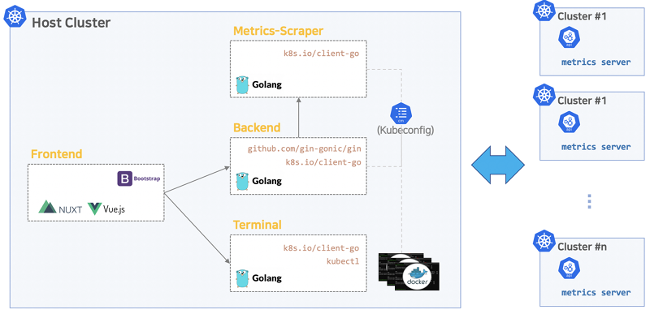

# Architecture

Kore-Board 프로젝트는 Frontend, Backend, Metric-Scraper, Terminal 4가지 컴포넌트로 구성됩니다.

Frontend는 브라우저에서 실행되는 단일 페이지 웹 애플리케이션으로 표준 HTTP 메서드를 사용하여 Backend에서 비즈니스 데이터를 조회합니다.

Backend는 데이터 요청을  원격 쿠버네티스 API로 프록시 처리하거나 비즈니스 로직을 구현하는 HTTP 서버로 원격 쿠버네티스 API가 필요한 정보를 직접 지원하지 않는 경우 비즈니스 로직을 구현합니다.

Metric-Scraper는 [metrics-server](https://github.com/kubernetes-sigs/metrics-server) 로 부터 주기적으로 메트릭 정보를 수집하고 저장하고 UI 요청에 따라 backend 를 거쳐 Frontend 에 매트릭 데이터를 제공합니다.

Terminal은 웹 UI에서 클러스터 및 파드 실행 터미널 서비스를 제공합니다.

아래 그림은 프로젝트의 아키텍처를 간략하게 보여줍니다.

## Summary of function points.

* Backend
  * 인증 (로그인, 로그아웃) 및 세션키 발급 
  * 멀티클러스터 Context 관리
  * 클러스터별 Kubernetes API-Server 연동
  * 클러스터별 Basic Core Resource 조회 및 생성,수정,삭제
  * Custom Resource 조회 및 생성,수정,삭제
  * Metrics-Scraper 연동을 통한 클러스터별, 노드별, 워크로드별 메트릭스 조회
  * Workload 확장 조회
  * 클러스터 이벤트 & 로그 조회
* Metrics-Scraper
  * 클러스터별 Metrics-Server 연동
  * 클러스터별 Metrics 수집 및 저장
  * 클러스터별, 노드별, 워크로드별 Metrics Summary API 제공
* Frontend
  * Backend, Metrics-Scraper, Terminal 컴포넌트 연동
  * Basic & Core Resource 조회 화면
  * Extention Resource 조회 화면
  * Resource 등록, 수정, 삭제 화면
  * Resource 검색 기능
  * 노드 및  워크로드 Terminal 서비스 화면
  * 워크로드 로그 조회 화면
* Terminal
  * 노드 및 워크로드에 대한 터미널 인스턴스
  * 멀티클러스터 Context 연계
  * 보안 인증 (Token) 처리
  * 터미널 화면 연계를 위한 Socket 모듈

## Summary of function points.

* Cluster
  * Topology
  * Namespaces
  * Events
* Workload
  * Pods
  * Deployments
  * StatefulSets
  * Cron Jobs
  * Jobs
  * Daemon Sets
  * Replica Sets
* Networking
  * Services
  * Ingress
  * Endpoints
  * Network Polices
* Storage
  * Persistent Volumn Claims
  * Persistent Volumns
  * Storage Classes
* Configuration
  * Config Maps
  * Secrets
  * Resource Quotas
  * Limit Ranges
  * Horizontal Pod Autoscalers
  * Pod Disruption Budgets
* Administrator
  * Service Accounts
  * Clsuter Roles
  * Clsuter Roles Bindings
  * Roles
  * Role Bindings
* Custom Resource
  * Definitions
  * CRD 
* Commons
  * Index(dashboard)
  * Login
  * Create
  * Terminal
  * Context Manager

## Repository directires
  * docs : documentations
  * scripts : install & build scripts
  * src : source codes root
  * src/app/frontend :  source codes of frontend component
  * src/app/backend : source codes of backend component
  * src/app/metric-server : source codes of metric-server component
  * src/app/terminal : source codes of terminal component

