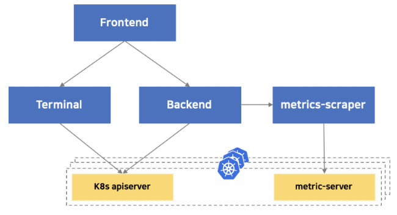

# Architecture

Kore-Board 프로젝트는 Frontend, Backend, Metric-Scraper, Terminal 4가지 컴포넌트로 구성됩니다.

Frontend는 브라우저에서 실행되는 단일 페이지 웹 애플리케이션으로 표준 HTTP 메서드를 사용하여 Backend에서 비즈니스 데이터를 조회합니다.

Backend는 데이터 요청을  원격 쿠버네티스 API로 프록시 처리하거나 비즈니스 로직을 구현하는 HTTP 서버로 원격 쿠버네티스 API가 필요한 정보를 직접 지원하지 않는 경우 비즈니스 로직을 구현합니다.

Metric-Scraper는 [metrics-server](https://github.com/kubernetes-sigs/metrics-server) 로 부터 주기적으로 메트릭 정보를 수집하고 저장하고 UI 요청에 따라 backend 를 거쳐 Frontend 에 매트릭 데이터를 제공합니다.

Terminal은 웹 UI에서 클러스터 및 파드 실행 터미널 서비스를 제공합니다.

아래 그림은 프로젝트의 아키텍처를 간략하게 보여줍니다.

* Frontend
  * Vue, NuxtJS framework
  * source code : src/app/frontend

* Backend
  * Golang
  * 소스코드 위치 src/app/backend 디렉토리

* Metric-Scraper
  * Golang
  * source code : src/app/metric-server

* Terminal
  * Golang
  * source code : src/app/terminal
