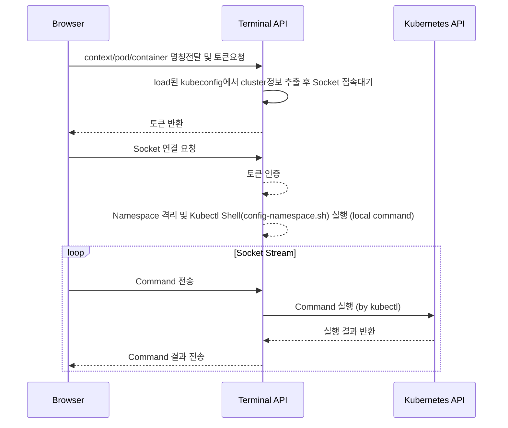

# Web Terminal API
> Web Terminal API for kubectl / pod / container

* language :  go-lang 1.15
* web frameworks : gorilla 

* Web Terminal 주요 참고 소스
  * https://github.com/KubeOperator/webkubectl

## 처리 흐름



## 구현 내용
  - linux `unshare` 명령을 사용해서 네임스페이스 단위로 고립 처리
  - unshare `--fork, --proc` 옵션을 통해서 메인 프로세스를 기준으로 서브 프로세스 (local command) 단위 네임스페이스 생성
  - unshare `--mount-proc --mount` 옵션을 통해서 프로세스의 네임스페이스로 마운트될 파일 시스템 구성 (kubectl 등이 설치된 파일 시스템)

- API 운영 및 터미널 에뮬레이터 처리
  - 서버(terminal)
    - API
    - socket (webtty)
    - 세션에 Connect 하면 격리 및 kubectl 환경 스크립트 실행 및 Socket 연계 처리
    - kubeconfig 는 volume mount 위치를 참조
  - 클라이언트(frontend)
    - xterm 스크립트
    - webtty (socket) 스크립트
    
## Run
* 제약사항
  * Web Terminal (context/pod/container 터미널접속) 기능은 linux OS의 unshare기능을 이용하기 때문에 container 환경에서만 동작합니다
  
    (Web terminal function is only run in container environment)


* 로컬 개발환경 실행(local development mode run)
```
npm run start:terminal
```
or    
```
$ docker run --rm --privileged -p 3003:3003 --name terminal \
             -v ~/.kube:/app/.kube \
             ghcr.io/acornsoftlab/kore-board.terminal:latest \
             --kubeconfig=/app/.kube/config \
             --corsonoff=off
```

* Arguments

|이름                   |기본값                 |설명                                                                                       |
|---                    |---                    |---                                                                                        |
|--kubeconfig           |                       |kubeconfig 파일 위치                                                                       |
|--log-level            |debug                  |로그 레벨(panic,fatal,error,warning,info,debug,trace) https://github.com/sirupsen/logrus)  |
|--corsonoff            |on                     |CORS(Cross-Origin Resource Sharing) on/off (defaults to on(blocked by CORS))  |


* 환경변수 (env)

|이름       |기본값 |설명                 |
|---        |---    |---                  |
|KUBECONFIG |       |kubeconfig 파일 위치 |


## API

* 아래 설명에서 사용하는 변수는 다음과 같습니다.
  * `clusters` : Kubeconfig context name
  * `namespaces` : Resource namespace
  * `pods` : Pod name
  * `containers` : Container name
  * `termtype` : terminal type(cluster/pod/container) 
   
|URL Pattern                                                                                                   |Method |설명                           |
|---                                                                                                           |---    |---                           |
|/api/terminal/clusters/{CLUSTER}/termtype/{TERMTYPE}                                                          |GET    |Web terminal 접속토큰 요청(kubectl)  |
|/api/terminal/clusters/{CLUSTER}/namespaces/{NAMESPACE}/pods/{POD}/termtype/{TERMTYPE}                        |GET    |Web terminal 접속토큰 요청(pod)      |
|/api/terminal/clusters/{CLUSTER}/namespaces/{NAMESPACE}/pods/{POD}/containers/{CONTAINER}/termtype/{TERMTYPE} |GET    |Web terminal 접속토큰 요청(container)|
|/api/terminal/ws                                                                                              |GET    |Web terminal websocket 접속요청 |
|/api/v1/config                                                                                                |PATCH  |kubeconfig refresh event from backend|


### examples

```
# Get token
$ curl http://localhost:3003/api/terminal/clusters/test-cluster/termtype/cluster
{"Success":true,"Token":"5v2rkaz26k95lckkxqt5"}

# Connect web socket
/src/app/frontend/pages/terminal.vue 참고
```

### Debugging for docker container environment
* Dockerfile Build 
  * 디버깅용 backend 이미지 빌드 
    docker-compose -f dc-debug.yaml up --build
  * vscode/golang 등 에디터 원격 디버깅 설정(remote port 5555)
  ```
        //example for vscode debugging
        //launch.json
        {
            "version": "0.2.0",
            "configurations": [
                {
                    "name": "Launch remote",
                    "type": "go",
                    "request": "attach",
                    "mode": "remote",
                    "remotePath": "",
                    "port": 5555,
                    "host": "127.0.0.1",
                    "showLog": true,
                    "trace": "log"

                }
            ]
        }
  ```
  * 참고링크 [컨테이너 내부 Go 애플리케이션 디버깅하기][https://mingrammer.com/debugging-containerized-go-app/]

  
